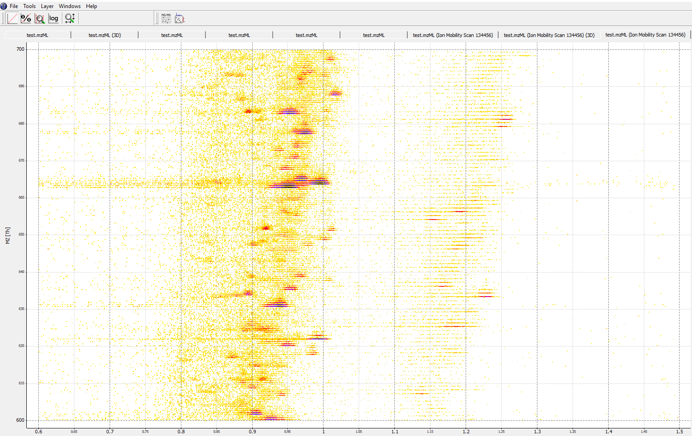
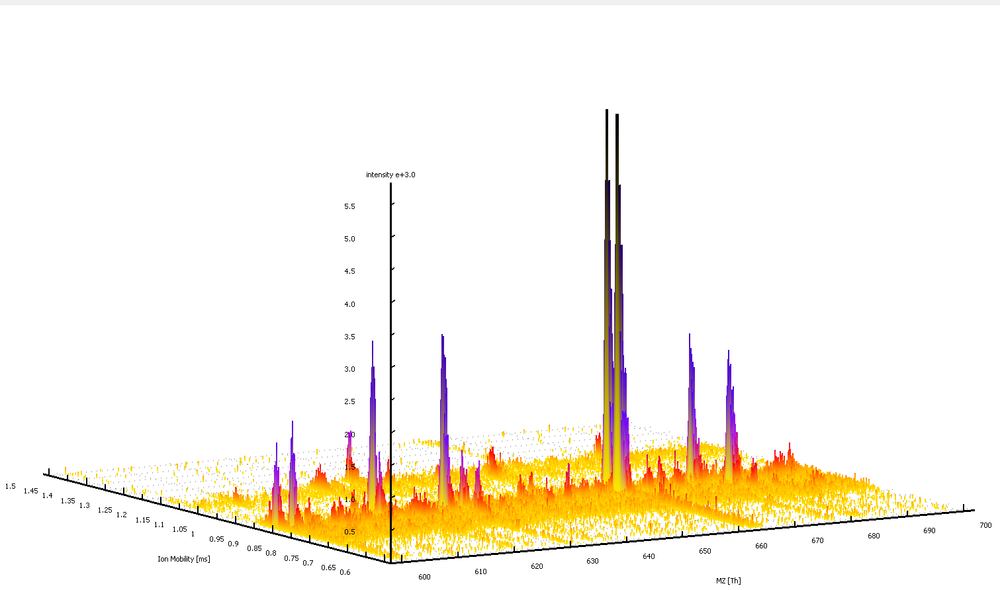

Data Visualization
==================

Other than using the ``plot_window_layout`` function in the package, the
data can also be visualized using OpenMS tools after conversion to mzML files.

OpenMS 2.4.0 version is capable of visualizing data with ion mobility values. 
Using ``ToppView``, you can now visualize the four dimensional data through 
slicing it by retention time and look at the MS spectrum.

This displays the map at retention time 4479 seconds, the features in a 2D map
with ion mobility and m/z. Switching it into 3D view, you can see the intensity
of the precursors.

OpenMS is now capable of handling ion mobility data with all of its previous 
usages remained functional.

