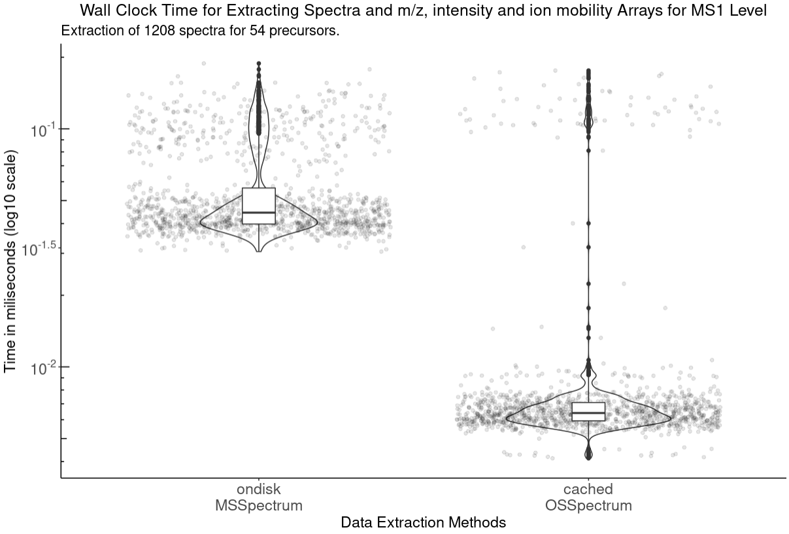
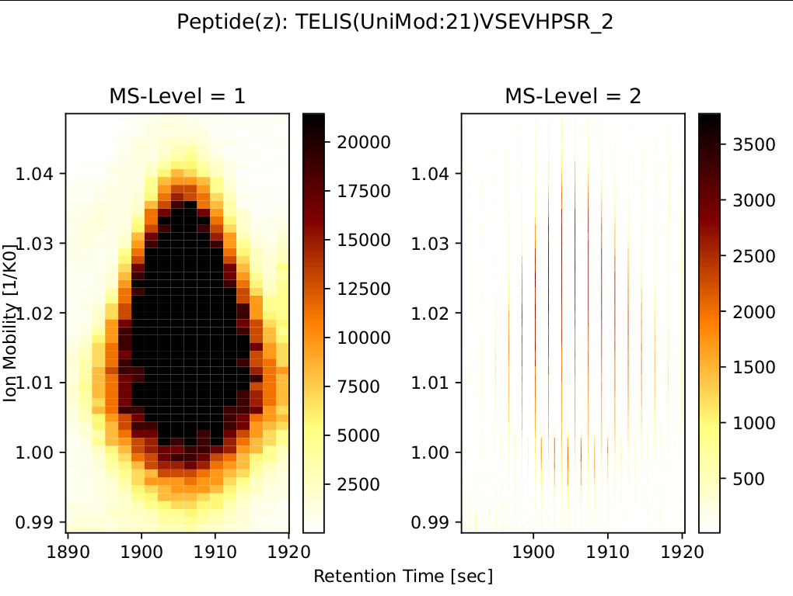
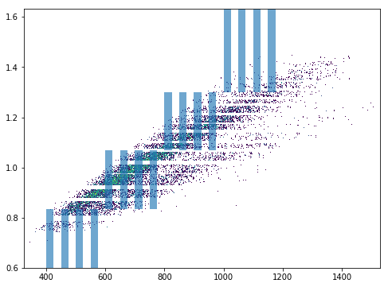
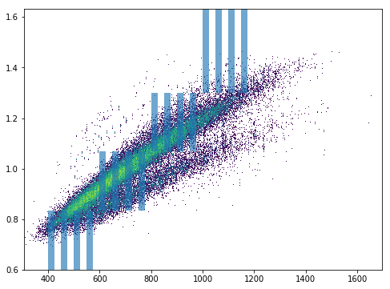

diapysef Vignette
=================

Author: Max Frank, Hannes Roest 

Contributors: Annie Ha, Joshua Charkow, Justin Sing 

Last Updated: 2022-11-09

diapysef is a convenience package for working with DIA-PASEF data. It
has functionalities to convert Bruker raw files into a format that
OpenMS can understand. Thus OpenSwath can be used to analyze the data
and TOPPView can be used to visualize. diapysef itself has also some
basic visualization capability that allows to display the window setting
of a DIA-PASEF run in the context of a precursor map.

Installation
------------

If you wish to install from pyPI

.. code:: bash

    $ pip install diapysef

.. raw:: html

   

   
Installing from source

If you wish to install from source, you can do the following:

.. code:: bash

    $python setup.py install

.. raw:: html

   

.. raw:: html

   

   
Legacy (version <= 0.3.5)

We have not uploaded this package to pyPI, since the package contains
some small example data and small amounts of bruker code. You can
install the package through the provided wheel. Make sure you have
python and pip installed. Then, in your terminal command prompt, run:

.. code:: bash

    ## Optional: if conversion with compression is required install the newest pyopenms nightly build
    ## Otherwhise, from the folder containing the .whl file run
    pip install diapysef-0.1-py2.py3-none-any.whl

On windows make sure that you add the Scripts/ folder of your python
installation to your PATH to be able to call the command line tools from
anywhere.

.. raw:: html

   

Running diapysef
=================

*diapysef* contains several tools and can be run via the command line, or can be used for scripting:

.. code:: bash

    $ diapysef --help

    Found Bruker sdk. Access to the raw data is possible. 

    Usage: diapysef [OPTIONS] COMMAND1 [ARGS]... [COMMAND2 [ARGS]...]...

    Mobi-DIK (Ion Mobility DIA Tool-Kit) is a package for analysis of DIA data
    coupled to ion mobility.

    Visit http://openswath.org/en/latest/docs/mobi-dik.html for usage
    instructions and help

    Options:
    --version  Show the version and exit.
    --help     Show this message and exit.

    Commands:
    converttdftomzml     Conversion program to convert a Bruker TIMS .d...
    export               Export a reduced targeted mzML file to a tsv file
    prepare-coordinates  Generate peptide coordinates for targeted...
    report               Generate a report for a specfific type of plot
    targeted-extraction  Extract from the raw data given a set of target...

Converting raw files
====================

.. code:: bash

    $ diapysef converttdftomzml --help

    Found Bruker sdk. Access to the raw data is possible. 

    Usage: diapysef converttdftomzml [OPTIONS]

    Conversion program to convert a Bruker TIMS .d data file to mzML format

    Options:
    --in PATH                       The location of the directory containing raw
                                    data (usually .d).  [required]
    --out TEXT                      The name of the output file (mzML).
                                    [required]
    --merge INTEGER                 Number of consecutive frames to sum up
                                    (squash). This is useful to boost S/N if
                                    exactly repeated frames are measured.
                                    [default: -1]
    --keep_frames / --no-keep_frames
                                    Whether to store frames exactly as measured
                                    or split them into individual spectra by
                                    precursor isolation window (default is to
                                    split them - this is almost always what you
                                    want).  [default: no-keep_frames]
    --verbose INTEGER               Verbosity.  [default: -1]
    --overlap INTEGER               How many overlapping windows were recorded
                                    for the same m/z window - will split the
                                    output into N output files.  [default: -1]
    --framerange TEXT               The minimum and maximum Frames to convert.
                                    Useful to only convert a part of a file.
                                    [default: [-1, -1]]
    --help                          Show this message and exit.

If you see an output like this:

::

    Bruker sdk not found. Some functionalities that need access to raw data will not be available. To activate that functionality place libtimsdata.so (Linux) or timsdata.dll in the src folder. 

    This functionality can only be carried out if the bruker sdk is present. Please install it first. The sdk can be installed by installing proteowizard(version >=3, http://proteowizard.sourceforge.net), or by placing the a library file in your path (For windows this will be timsdata.dll and for Linux libtimsdata.so).

*diapysef* will attempt to install the appropriate sdk for your system to the current working directory. If this fails, you will have to manually install it yourself.

.. raw:: html

   

   
Example Command

.. code:: bash

    diapysef converttdftomzml --in IPP_U1_B10_60min_400nL_Slot1-10_1_1192_6-16-2021.d --out test_diapysef.mzML
    Found Bruker sdk. Access to the raw data is possible.

    [2022-11-09 09:58:00] INFO: Converting IPP_U1_B10_60min_400nL_Slot1-10_1_1192_6-16-2021.d...
    Analysis has 38269 frames.
    100%|████████████████████████████████████████████████████████████████████████████| 38269/38269 [48:27<00:00, 13.16it/s]
    [2022-11-09 10:46:31] INFO: Finished converting TDF data to mzML!

.. raw:: html

   

.. raw:: html

   

   
Legacy (version <= 0.3.5)

Assuming you have added the python scripts folder to your path you can
simply run:

.. code:: bash

    convertTDFtoMzML.py 

If you see an output like this:

::

    Bruker sdk not found. Some functionalities that need access to raw data will not be available. To activate that functionality place libtimsdata.so (Linux) or timsdata.dll in the src folder. 

    This functionality can only be carried out if the bruker sdk is present. Please install it first. The sdk can be installed by installing proteowizard(version >=3, http://proteowizard.sourceforge.net), or by placing the a library file in your path (For windows this will be timsdata.dll and for Linux libtimsdata.so).

You will have to install a Bruker sdk that can handle TDF3.0. You can
either place the sdk file in your working directory (safest option) or
somewhere in your PATH. Another option is to install the latest version
of ProteoWizard which supports access to the bruker sdk.

| Now you can run the tool without arguments to get the usage info:
| ``bash convertTDFtoMzML.py``

::

    Found Bruker sdk. Access to the raw data is possible. 

    usage: convertTDFtoMzML.py [-h] -a ANALYSIS_DIR -o OUTPUT_FNAME
                               [-m MERGE_SCANS] [-r FRAME_LIMIT FRAME_LIMIT]
    convertTDFtoMzML.py: error: the following arguments are required: -a/--analysis_dir, -o/--output_name

.. raw:: html

   

Targeted Data Extraction
========================

Generating peptide coordinates for targeted raw data extraction
---------------------------------------------------------------

In order to extract a targeted region of the data, you need peptide coordinates that contain the necessary m/z, RT, and ion mobility information to extract data in a targeted region.

.. code:: bash

    diapysef prepare-coordinates --help

.. raw:: html

   

   
Example Command

.. code:: bash

    diapysef prepare-coordinates --in merged.osw --out peptides_coord_ex.pkl --run_id 5500589384113116496 --target_peptides '["T(UniMod:21)ELISVSEVHPSR", "TELIS(UniMod:21)VSEVHPSR"]' 
    Bruker sdk not found. Some functionalities that need access to raw data will not be available. To activate that functionality place libtimsdata.so (Linux) or timsdata.dll in the src folder. 

    [2022-09-06 11:16:26] INFO: Generating coordinates...
    [2022-09-06 11:16:26] INFO: Finished generating coordinates!

**NOTE:** We specify run_id if we pass a merged osw, so that we get coordinates for a specific run with targeted RT and IM identification coordinates

**NOTE:** A *merged.osw* can be obtained by an OpenMS-OpenSwathWorkflow-PyProphet workflow. See [openswath.org](openswath.org) for information on how to perform an OpenSwathWorkflow.

.. raw:: html

   

.. raw:: html

   

   
Example Peptide Coordinate Python Dictionary

If you want to manually generate a peptide coordinate dictionary, it should look something like the following:

::

    peptides = { 
                'T(UniMod:21)ELISVSEVHPSR_2': {
                        'peptide': 'T(UniMod:21)ELISVSEVHPSR', 
                        'precursor_mz': 767.3691, 
                        'charge': 2, 
                        'rt_apex': 1730.08, 
                        'im_apex': 1.026132868499893, 
                        'qvalue': 0.0, 
                        'product_mz': [496.2627, 811.4057, 910.4741, 997.5061, 1110.5902, 1223.6743], 
                        'product_charge': [1, 1, 1, 1, 1, 1], 
                        'product_annotation': ['y4^1', 'y7^1', 'y8^1', 'y9^1', 'y10^1', 'y11^1'], 
                        'product_detecting': [1, 1, 1, 1, 1, 1], 
                        'rt_boundaries': [1718.036865234375, 1751.983642578125]}, 
                    'TELIS(UniMod:21)VSEVHPSR_2': {
                        'peptide': 'TELIS(UniMod:21)VSEVHPSR', 
                        'precursor_mz': 767.3691, 
                        'charge': 2, 
                        'rt_apex': 1905.32, 
                        'im_apex': 1.018710764387254, 
                        'qvalue': 5.231105591576423e-08, 
                        'product_mz': [344.1816, 359.2037, 724.3737, 811.4057, 910.4741, 1077.4725], 
                        'product_charge': [1, 1, 1, 1, 1, 1], 
                        'product_annotation': ['b3^1', 'y3^1', 'y6^1', 'y7^1', 'y8^1', 'y9^1'], 
                        'product_detecting': [1, 1, 1, 1, 1, 1], 
                        'rt_boundaries': [1889.531494140625, 1918.104248046875]}, 
                    'TELIS(UniMod:21)VSEVHPSR_3': {
                        'peptide': 'TELIS(UniMod:21)VSEVHPSR', 
                        'precursor_mz': 511.9151, 
                        'charge': 3, 
                        'rt_apex': 1932.09, 
                        'im_apex': 0.819074213225268, 
                        'qvalue': 0.013292880776271469, 
                        'product_mz': [359.2037, 496.2627, 595.3311, 811.4057, 1077.4725, 1303.6406], 
                        'product_charge': [1, 1, 1, 1, 1, 1], 
                        'product_annotation': ['y3^1', 'y4^1', 'y5^1', 'y7^1', 'y9^1', 'y11^1'], 
                        'product_detecting': [1, 1, 1, 1, 1, 1], 
                        'rt_boundaries': [1917.89404296875, 1953.622314453125]}
                }

**NOTE:** we create separate coordinates for peptide ion charge states. Each precursor ion (peptide of specific charge state), will have its own nested dictionary of target coordinate paramaters. 
I.e. the peptide *T(UniMod:21)ELISVSEVHPSR* can have multiple charge states, and should be separated as *T(UniMod:21)ELISVSEVHPSR_2* and *T(UniMod:21)ELISVSEVHPSR_3* to indicated a charge 2 precursor and a charge 3 precursor respectively.

Not all the values are necessary, however, the ones that are needed are: **peptide**, **precursor_mz**, **charge**, **rt_apex**, **im_apex**, **product_mz**.

You can save the dictionary to a pickle file using the following code:

.. code:: bash

    import pickle
    with open(f"peptides.pkl", "wb") as output_file: pickle.dump(peptides, file=output_file, )

.. raw:: html

   

Targeted Extraction of the Raw diaPASEF mzML data
-------------------------------------------------

To reduce the raw diaPASEF data, for visualization or for preliminary algorithm development, you can perform a targeted extraction of the data to reduce the data given target coordinates 

.. code:: bash

    $ diapysef targeted-extraction --help

.. raw:: html

   

   
Example Command

.. code:: bash

    $ diapysef targeted-extraction --in IPP_M10_DIA-PaSEF_60min_Bruker10_400nL_1ul-inj-redo2_Slot2-25_1_2151.mzML --coords peptides_coord_ex.pkl --verbose 0 --mslevel [1,2] --mz_tol 20 --rt_window 50

    Bruker sdk not found. Some functionalities that need access to raw data will not be available. To activate that functionality place libtimsdata.so (Linux) or timsdata.dll in the src folder. 

    [2022-09-07 12:07:19] INFO: Loading data...
    [2022-09-07 12:07:46] INFO: Reducing spectra using targeted coordinates...
    INFO: Processing..TELIS(UniMod:21)VSEVHPSR_3: 100%|██████████████████████████████████████████████████████████████████████████████████████████████████| 3/3 [01:13<00:00, 24.35s/it]
    [2022-09-07 12:09:00] INFO: Finished extracting targeted spectra!

.. raw:: html

   

**NOTE:** You may get a speed performance boost if you use cached mzML files (files produced from OpenSwathWorflow when using *cacheWorkingInMemory*).

.. raw:: html

   

   
Using Cache vs On Disk Speed Comparisons

Cached spectra processing is now 10 fold faster than ondisk, using `hroest/OpenMS/tree/feature/drift_time_os_spec_2 <https://github.com/hroest/OpenMS/tree/feature/drift_time_os_spec_2>`_

It also now only takes 21.0601 sec to reduce the spectra from cache, vs 74.5139 sec to reduce the spectra from ondisk

On Disk Experiment
~~~~~~~~~~~~~~~~~~

.. code:: bash

    diapysef targeted-extraction --in data/raw/IPP_M10_DIA-PaSEF_60min_Bruker10_400nL_1ul-inj-redo2_Slot2-25_1_2151_MS1.mzML --coords peptides.pkl --readOptions ondisk --verbose 1 --mslevel [1] --mz_tol 20 --rt_window 40 --im_window 0.08
    Found Bruker sdk. Access to the raw data is possible.

    [2022-09-30 13:18:20] INFO: Loading data...
    [2022-09-30 13:20:34] INFO: Reducing spectra using targeted coordinates...
    INFO: Processing..YVC(UniMod:4)EGPSHGGLPGAS(UniMod:21)SEK_3: 100%|███████████████████████████████████████████████████████████| 54/54 [01:14<00:00, 1.38s/it]
    [2022-09-30 13:21:48] INFO: Finished extracting targeted spectra!

Cached
~~~~~~

.. code:: bash

    diapysef targeted-extraction --in data/raw/cached/20220928_171403_179508ef404e_1_1_ms1.mzML --coords peptides.pkl --readOptions cached --verbose 1 --mslevel [1] --mz_tol 20 --rt_window 40 --im_window 0.08
    Found Bruker sdk. Access to the raw data is possible.

    [2022-09-30 13:41:11] INFO: Loading data...
    [2022-09-30 13:41:11] INFO: Reducing spectra using targeted coordinates...
    INFO: Processing..YVC(UniMod:4)EGPSHGGLPGAS(UniMod:21)SEK_3: 100%|███████████████████████████| 54/54 [00:21<00:00, 2.57it/s]
    [2022-09-30 13:41:32] INFO: Finished extracting targeted spectra!

.. raw:: html

   

Exporting reduced targeted mzML for easier data manipulation and plotting
-------------------------------------------------------------------------

We can export the reduced mzML to a tsv file with m/z, retention time, ion mobility and intensity data as along tsv file

.. code:: bash

    $ diapysef export --help

.. raw:: html

   

   
   
Example Command

.. code:: bash

        $ diapysef export --in targed_data_extraction.mzML --out extracted_data.tsv --mslevel [1,2] --verbose 10 --log_file export.log

        Bruker sdk not found. Some functionalities that need access to raw data will not be available. To activate that functionality place libtimsdata.so (Linux) or timsdata.dll in the src folder. 

        [2022-09-07 12:09:34] INFO: Loading data...
        100%|████████████████████████████████████████████████████████████████████████████████████████████████████████████████████████████████████████| 5460/5460 [00:00<00:00, 6816.65it/s]
        [2022-09-07 12:09:36] INFO: Finished exporting data!

.. raw:: html

   

Generating a report of RT and IM Heatmap plots
----------------------------------------------

We can generate a 2D heatmap of the data using the report module. The current implementation is a quick plotting implementation in matplotlib. You could use other plotting tools libraries to make nice plots if you want, using the extracted_data.tsv file.

.. code:: bash

    $ diapysef report --help

.. raw:: html

   

   
Example Command

.. code:: bash

    $ diapysef report --in extracted_data.tsv --out diapasef_report_rt_im.pdf 

    Bruker sdk not found. Some functionalities that need access to raw data will not be available. To activate that functionality place libtimsdata.so (Linux) or timsdata.dll in the src folder. 

    [2022-09-07 12:13:14] INFO: Generating a report of plots for a Retention Time and Ion Mobility Heatmaps...
    INFO: Plotting..TELIS(UniMod:21)VSEVHPSR_3: 100%|████████████████████████████████████████████████████████████████████████████████████████████████████| 3/3 [00:02<00:00,  1.16it/s]
    [2022-09-07 12:13:16] INFO: Finished generating report!

.. raw:: html

   

Data access and convenience functions
=====================================

The rest of the tools are available as scripts but can also be used in a
more modular fashion from wihtin python directly. It can access raw
files from both PASEF and DIA-PASEF runs and reads in some MaxQuant txt
files. Since these functions do not acutally need acess to the raw data,
they can also be run without the sdk.

Obtaining a window layout file
------------------------------

This can be done with a commandline tool:

.. code:: bash

    get_dia_windows.py 20180320_AnBr_SA_diaPASEF_200ng_HeLa_Rost_Method_4_a_01_A1_01_2143.d/ windows.csv

Or in python:

.. code:: python3

    import diapysef as dp
    
    # Open connection to a DIA-PASEF run
    dia = dp.TimsData("/media/max/D6E01AF3E01ADA17/code/dia-pasef/bruker/20180320_AnBr_SA_diaPASEF_200ng_HeLa_Rost_Method_4_a_01_A1_01_2143.d/")
    # Obtain the window layout from the first frames
    win = dia.get_windows()
    # Save as csv
    win.to_csv("window_layout.csv")
    print("File Written")

.. parsed-literal::

    File Written

Annotating ion mobilities
-------------------------

This is useful to convert scan numbers which are corresponding to
different ion mobilities depending on the run to 1/K0 which is a more
standardized measure.

This is needed, for example, to generate a library for OpenSwath
targeted extraction. We can annotate Ion mobilities with 1/K0 values in
a maxquant output using the calibration information in the raw file.

.. code:: bash

    annotate_mq_ionmobility.py 20180309_HeLa_MQ_combined/ 20180309_TIMS1_Metab_AnBr_SA_200ng_HELA_Bremen13_14_A1_01_2129.d/ annotated1K0

Or in python:

.. code:: python3

    import diapysef as dp
    
    #Open connection to the pasef data file
    pas = dp.PasefData("/media/max/D6E01AF3E01ADA17/code/dia-pasef/bruker/20180309_TIMS1_Metab_AnBr_SA_200ng_HELA_Bremen13_14_A1_01_2129.d/")
    # Open connection to the Maxquant output from the same run
    mq = dp.PasefMQData("/media/max/D6E01AF3E01ADA17/code/dia-pasef/bruker/20180309_HeLa_MQ_combined/")
    
    ## Annotate all peptides
    # Read in the allPeptides table from the output and annotate with 1/K0 using the calibration obtained from pas
    mq.get_all_peptides()
    mq.annotate_ion_mobility(pas)
    #Or more directly
    mq.get_all_peptides(pas)
    # Save the table
    all_pep = mq.all_peptides
    all_pep.to_csv("all_peptides_1K0.csv")
    
    ## Annotate evidence
    # Read in the allPeptides table from the output and annotate with 1/K0 using the calibration obtained from pas
    mq.get_evidence()
    mq.annotate_ion_mobility(pas)
    #Or more directly
    mq.get_evidence(pas)
    # Save the table
    ev = mq.evidence
    ev.to_csv("evidence_1K0.csv")
    

Plotting window layouts
-----------------------

The above operations let you obtain a precursor map (either with all MS1
features or with the peptide evidence) and a window layout. It is
informative to plot these together to get some insight into how well the
windows cover the precursor space.

We provide the following plotting function, as a commandline script

.. code:: bash

    plot_dia_windows.py window_layout.csv all_peptides_1K0.csv

Or in python:

.. code:: python3

    import diapysef as dp
    import pandas as pd
    
    dia = dp.TimsData("/media/max/D6E01AF3E01ADA17/code/dia-pasef/bruker/20180320_AnBr_SA_diaPASEF_200ng_HeLa_Rost_Method_4_a_01_A1_01_2143.d/")
    win = dia.get_windows()
    # Diapysef saves a precursor layout from a Pasef run internally so it is possible to quickly plot windows without
    # specifying a precursor map
    dp.plot_window_layout(windows = win)
    
    # If the windows should be plotted against a certain precursor map (e.g. all_peptides obtained above) you can specify
    # an additional dataframe
    precursors = pd.read_csv("all_peptides_1K0.csv")
    
    dp.plot_window_layout(windows = win, precursor_map = precursors)

Docker image
============

There is a docker image available on docker hub `singjust/modibik <https://hub.docker.com/r/singjust/mobidik>`_

.. raw:: html

   

   
Useage

.. code:: bash

    $ docker run -it --rm -v $PWD:/data/ singjust/mobidik:latest diapysef --help
    Found Bruker sdk. Access to the raw data is possible. 

    Usage: diapysef [OPTIONS] COMMAND1 [ARGS]... [COMMAND2 [ARGS]...]...

    Mobi-DIK (Ion Mobility DIA Tool-Kit) is a package for analysis of DIA data
    coupled to ion mobility.

    Visit http://openswath.org/en/latest/docs/mobi-dik.html for usage
    instructions and help

    Options:
    --version  Show the version and exit.
    --help     Show this message and exit.

    Commands:
    converttdftomzml     Conversion program to convert a Bruker TIMS .d...
    export               Export a reduced targeted mzML file to a tsv file
    prepare-coordinates  Generate peptide coordinates for targeted...
    report               Generate a report for a specfific type of plot
    targeted-extraction  Extract from the raw data given a set of target...

.. raw:: html

   

