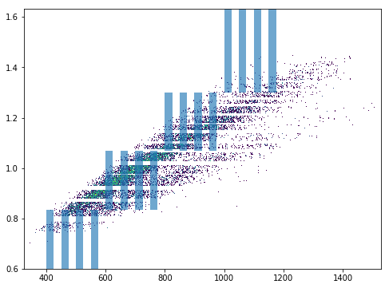
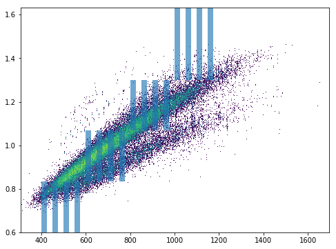

diapysef Vignette
=================

Author: Max Frank, Hannes Roest Date: 2018-04-26

diapysef is a convenience package for working with DIA-PASEF data. It
has functionalities to convert Bruker raw files into a format that
OpenMS can understand. Thus OpenSwath can be used to analyze the data
and TOPPView can be used to visualize. diapysef itself has also some
basic visualization capability that allows to display the window setting
of a DIA-PASEF run in the context of a precursor map.

Installation
------------

We have not uploaded this package to pyPI, since the package contains
some small example data and small amounts of bruker code. You can
install the package through the provided wheel. Make sure you have
python and pip installed. Then, in your terminal command prompt, run:

.. code:: bash

    ## Optional: if conversion with compression is required install the newest pyopenms nightly build
    ## Otherwhise, from the folder containing the .whl file run
    pip install diapysef-0.1-py2.py3-none-any.whl

On windows make sure that you add the Scripts/ folder of your python
installation to your PATH to be able to call the command line tools from
anywhere.

Converting raw files
--------------------

Assuming you have added the python scripts folder to your path you can
simply run:

.. code:: bash

    convertTDFtoMzML.py 

If you see an output like this:

::

    Bruker sdk not found. Some functionalities that need access to raw data will not be available. To activate that functionality place libtimsdata.so (Linux) or timsdata.dll in the src folder. 

    This functionality can only be carried out if the bruker sdk is present. Please install it first. The sdk can be installed by installing proteowizard(version >=3, http://proteowizard.sourceforge.net), or by placing the a library file in your path (For windows this will be timsdata.dll and for Linux libtimsdata.so).

You will have to install a Bruker sdk that can handle TDF3.0. You can
either place the sdk file in your working directory (safest option) or
somewhere in your PATH. Another option is to install the latest version
of ProteoWizard which supports access to the bruker sdk.

| Now you can run the tool without arguments to get the usage info:
| ``bash convertTDFtoMzML.py``

::

    Found Bruker sdk. Access to the raw data is possible. 

    usage: convertTDFtoMzML.py [-h] -a ANALYSIS_DIR -o OUTPUT_FNAME
                               [-m MERGE_SCANS] [-r FRAME_LIMIT FRAME_LIMIT]
    convertTDFtoMzML.py: error: the following arguments are required: -a/--analysis_dir, -o/--output_name

Data access and convenience functions
-------------------------------------

The rest of the tools are available as scripts but can also be used in a
more modular fashion from wihtin python directly. It can access raw
files from both PASEF and DIA-PASEF runs and reads in some MaxQuant txt
files. Since these functions do not acutally need acess to the raw data,
they can also be run without the sdk.

Obtaining a window layout file
~~~~~~~~~~~~~~~~~~~~~~~~~~~~~~

This can be done with a commandline tool:

.. code:: bash

    get_dia_windows.py 20180320_AnBr_SA_diaPASEF_200ng_HeLa_Rost_Method_4_a_01_A1_01_2143.d/ windows.csv

Or in python:

.. code:: python3

    import diapysef as dp
    
    # Open connection to a DIA-PASEF run
    dia = dp.TimsData("/media/max/D6E01AF3E01ADA17/code/dia-pasef/bruker/20180320_AnBr_SA_diaPASEF_200ng_HeLa_Rost_Method_4_a_01_A1_01_2143.d/")
    # Obtain the window layout from the first frames
    win = dia.get_windows()
    # Save as csv
    win.to_csv("window_layout.csv")
    print("File Written")

.. parsed-literal::

    File Written

Annotating ion mobilities
~~~~~~~~~~~~~~~~~~~~~~~~~

This is useful to convert scan numbers which are corresponding to
different ion mobilities depending on the run to 1/K0 which is a more
standardized measure.

This is needed, for example, to generate a library for OpenSwath
targeted extraction. We can annotate Ion mobilities with 1/K0 values in
a maxquant output using the calibration information in the raw file.

.. code:: bash

    annotate_mq_ionmobility.py 20180309_HeLa_MQ_combined/ 20180309_TIMS1_Metab_AnBr_SA_200ng_HELA_Bremen13_14_A1_01_2129.d/ annotated1K0

Or in python:

.. code:: python3

    import diapysef as dp
    
    #Open connection to the pasef data file
    pas = dp.PasefData("/media/max/D6E01AF3E01ADA17/code/dia-pasef/bruker/20180309_TIMS1_Metab_AnBr_SA_200ng_HELA_Bremen13_14_A1_01_2129.d/")
    # Open connection to the Maxquant output from the same run
    mq = dp.PasefMQData("/media/max/D6E01AF3E01ADA17/code/dia-pasef/bruker/20180309_HeLa_MQ_combined/")
    
    ## Annotate all peptides
    # Read in the allPeptides table from the output and annotate with 1/K0 using the calibration obtained from pas
    mq.get_all_peptides()
    mq.annotate_ion_mobility(pas)
    #Or more directly
    mq.get_all_peptides(pas)
    # Save the table
    all_pep = mq.all_peptides
    all_pep.to_csv("all_peptides_1K0.csv")
    
    ## Annotate evidence
    # Read in the allPeptides table from the output and annotate with 1/K0 using the calibration obtained from pas
    mq.get_evidence()
    mq.annotate_ion_mobility(pas)
    #Or more directly
    mq.get_evidence(pas)
    # Save the table
    ev = mq.evidence
    ev.to_csv("evidence_1K0.csv")
    

Plotting window layouts
~~~~~~~~~~~~~~~~~~~~~~~

The above operations let you obtain a precursor map (either with all MS1
features or with the peptide evidence) and a window layout. It is
informative to plot these together to get some insight into how well the
windows cover the precursor space.

We provide the following plotting function, as a commandline script

.. code:: bash

    plot_dia_windows.py window_layout.csv all_peptides_1K0.csv

Or in python:

.. code:: python3

    import diapysef as dp
    import pandas as pd
    
    dia = dp.TimsData("/media/max/D6E01AF3E01ADA17/code/dia-pasef/bruker/20180320_AnBr_SA_diaPASEF_200ng_HeLa_Rost_Method_4_a_01_A1_01_2143.d/")
    win = dia.get_windows()
    # Diapysef saves a precursor layout from a Pasef run internally so it is possible to quickly plot windows without
    # specifying a precursor map
    dp.plot_window_layout(windows = win)
    
    # If the windows should be plotted against a certain precursor map (e.g. all_peptides obtained above) you can specify
    # an additional dataframe
    precursors = pd.read_csv("all_peptides_1K0.csv")
    
    dp.plot_window_layout(windows = win, precursor_map = precursors)

